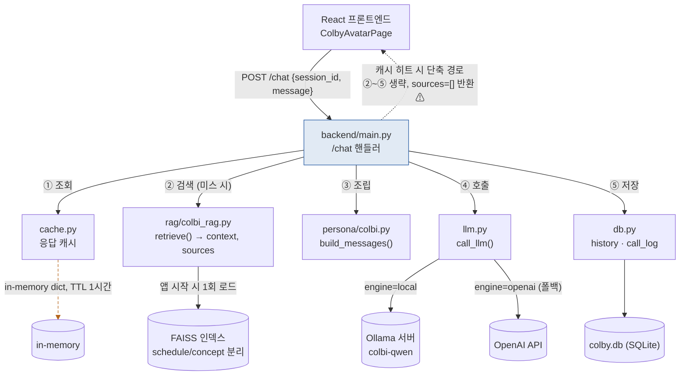
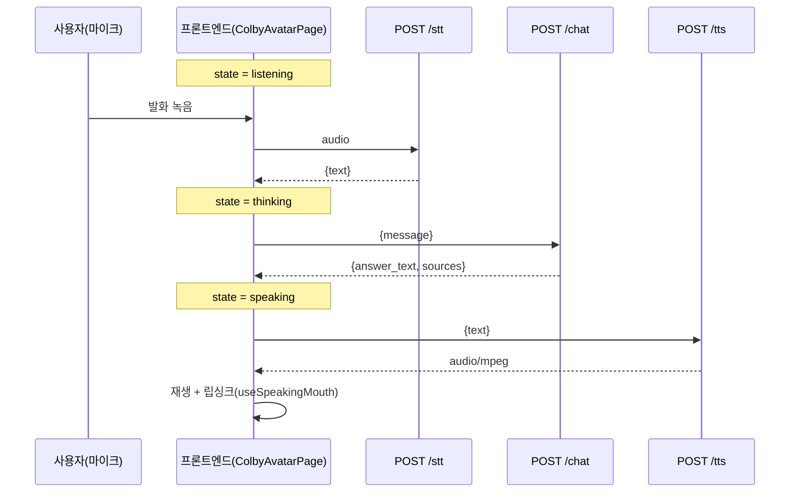

# 콜비(COLBY) 시스템 구성도 (초안)

작성: 임강 · 2026-08-21 · 기준 커밋 `0cbf4b7` (origin/develop, PR#18 반영분)
상태: **초안** — 결과보고서 §4 "시스템 구성도" 자료용. 시각적으로 다듬은 버전은 별도 아티팩트로 공유함(팀 채널 참고).

## 그림 1 — `/chat` 요청이 백엔드 내부를 지나가는 경로

캐시 미스 시 정상 흐름(①~⑤)과, 캐시 히트 시 단축 경로(점선)를 함께 표시. 단축 경로는 `sources`를 저장하지 않아 RAG 근거가 빠지는 알려진 한계(2026-08-21 발견)와 직결됨 — §7 "테스트 결과와 한계"에서 재사용.

**해석**: 정상 흐름(실선)은 캐시 미스일 때만 RAG→persona→LLM→DB를 전부 거친다. `cache.set()`이 답변 텍스트만 저장하고 `sources`는 저장하지 않기 때문에, 같은 질문이 캐시에 걸리면(점선) RAG 근거 표시가 빈 배열로 나간다 — RAG 재도입의 핵심 가치(근거 기반 답변)와 충돌하는 구조적 버그. PM·장두호에게 전달 완료, 아직 미수정.

---

## 그림 2 — 발화 한 턴의 API 호출 순서와 아바타 상태

**해석**: 아바타 상태(idle→listening→thinking→speaking)는 API 경계와 정확히 겹치지 않는다 — listening은 녹음+STT 응답 대기를 모두 덮고, speaking은 TTS 호출+재생을 모두 덮는다. `/chat`은 내부적으로 STT·TTS를 호출하지 않으며, 프론트가 4단계를 순차 호출해 조합하는 구조다(2026-08-14 팀 확정 설계 — 스트리밍 미사용, 동기 요청/응답).

**⚠️ 이 그림은 목표 파이프라인이다.** 2026-08-21 기준 `/stt`·`/chat`·`/tts` 개별 API는 각각 동작이 검증됐지만, 프론트엔드 마이크 버튼이 이 4단계를 실제로 순차 호출하도록 연동하는 작업은 진행 중이다(백승옥 담당, PR#19는 아바타 UI·상태머신까지만 완료).

---

## 참고

- 두 그림 모두 `origin/develop`의 `backend/main.py`·`backend/stt.py`·`backend/llm.py` 실코드 및 `CLAUDE.md` 3차 설계 결정과 대조해 작성.
- 시각적으로 다듬은 버전(색상·범례·상세 캡션 포함)은 별도로 공유함 — 발표자료·보고서 캡처용으로는 그쪽을 권장.
- 그림 1의 캐시-sources 버그, 그림 2의 프론트 연동 미완료 상태는 모두 §7(테스트 결과와 한계) 초안 작성 시 그대로 재사용 가능.
